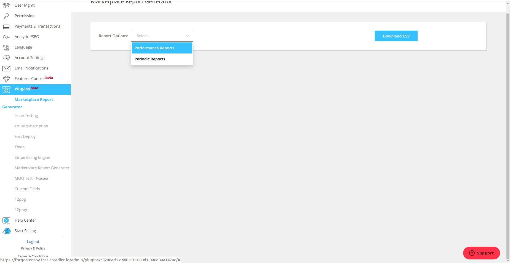
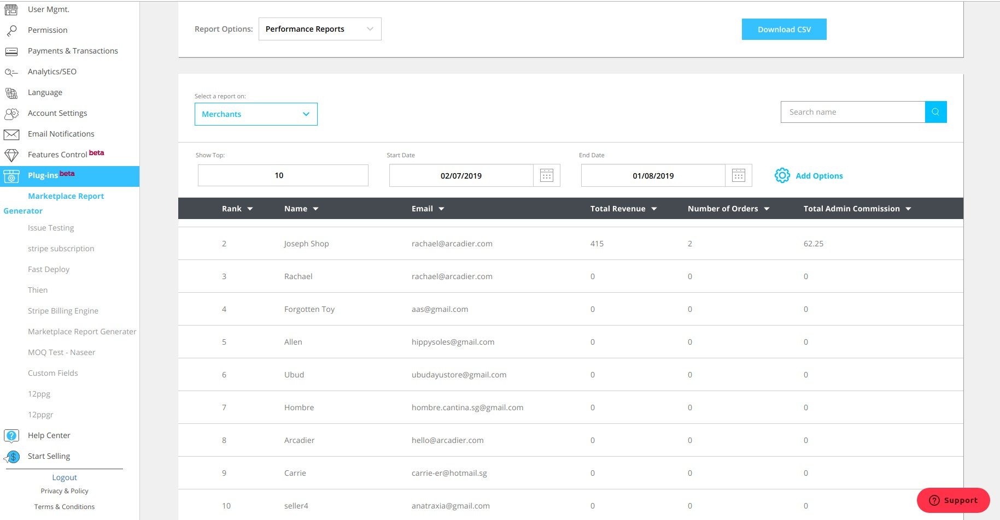
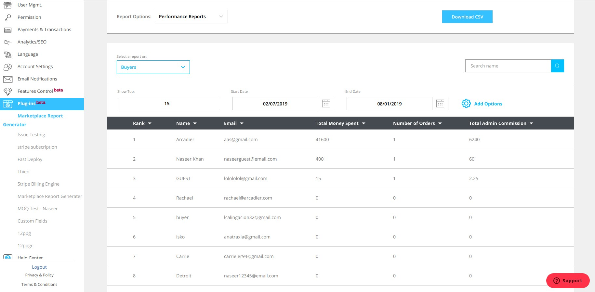
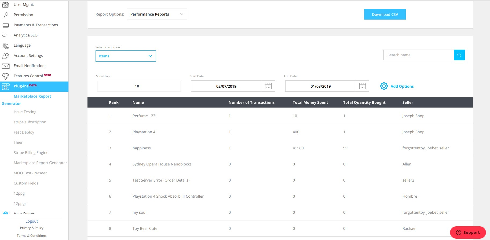
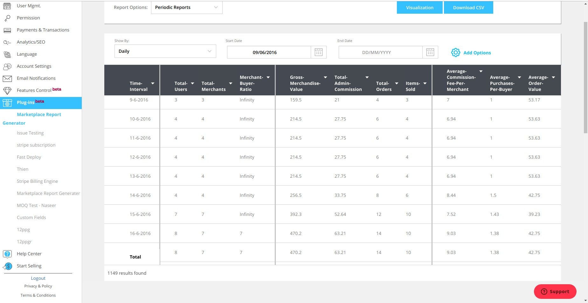
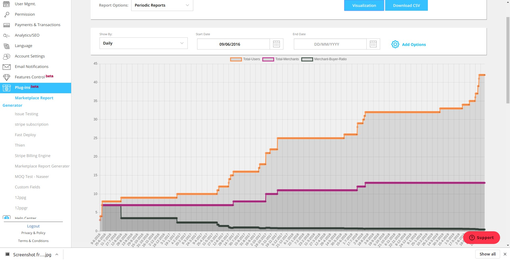

# Marketplace Report Generator

The marketplace report generator is an analytics tool which calculates different metrics, which indicate the growth of the marketplace. These metrics are generated in the form of reports. There are two types of reports performance reports and periodic reports. Performance reports show statistics of the top performing merchants, users items and payment gateways. Periodic reports show metrics organized by time durations, metrics such as gross merchandise value, logins, new users are organized by time and is displayed in a report. Periodic reports also have a visualization option which enables you to graph the tables, into respective graphs.

## Performance reports

Performance reports rank merchants, customers, items and payment gateways based on revenue earned, money spent, number of transactions and money transferred respectively. Performance reports enables you to pick a time duration, after entering a start date and an end date the report generator generates a report containing the top rankings in this duration. Performance reports give you the option of selecting the number of ranks you wish to see, by default this is set to 10. We have additional options you can select for merchants and users. There is a search bar which lets you search by any metric column, first name, last name and display name. You may sort the data by each column. Once a report is generated, you may download a CSV with all the required statistics in a spreadsheet format.

### Merchants

Merchants are one category ranked in the performance reports, they are ranked based on the total revenue they have earned. Metrics shown for each merchant are email, total revenue, number of orders recieved and total commission. You are also given the option to add in 2 additional metrics, location and logins.

### Buyers

Buyers are one category ranked in the performance reports, they are ranked based on the total amount of money they have spent. Metrics shown for each buyer are email, total money spent, number of orders and total commission. You may also pick two additional metrics, location and logins.

### Payment gateways

Payment gateways are ranked in performance reports, they are ranked based on the total amount of money transferred through the payment gateway. Metrics shown for each payment gateway are money transferred and admin commission earned.

### Items

Items are ranked in performance reports, they are ranked by the total amount of transactions. Metrics shown corresponding to each item are total money spent, total quantity bought and seller.

## Periodic reports

Periodic reports show different metrics, sorted by timedurations. The display format of data can either be daily, weekly, monthly, quarterly and yearly, each corresponds to a different time duration. Start date and end date maybe selected, the report generated will contain values of the metrics in the corresponding time duration. The metrics selected by default are total users, total merchants, gross merchandise value and total admin commission. Additional metrics which can be selected are orders, items sold, items refunded, merchant-buyer ratio, average revenue per merchant, average commission fee per merchant, ratio of orders made by registered user to guests, total logins, average purchases per buyer and average order value. The table data maybe sorted by each column. Once the report has been generated, you may visualize the data through a graph or download a CSV containing all the data in spreadsheet format.

### Visualization

You may click the visualization button to view the graph data of the reports generated.

